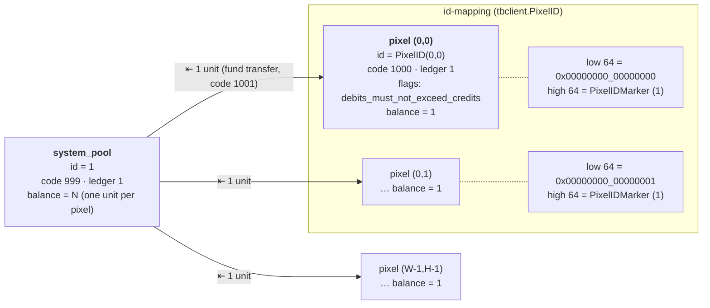
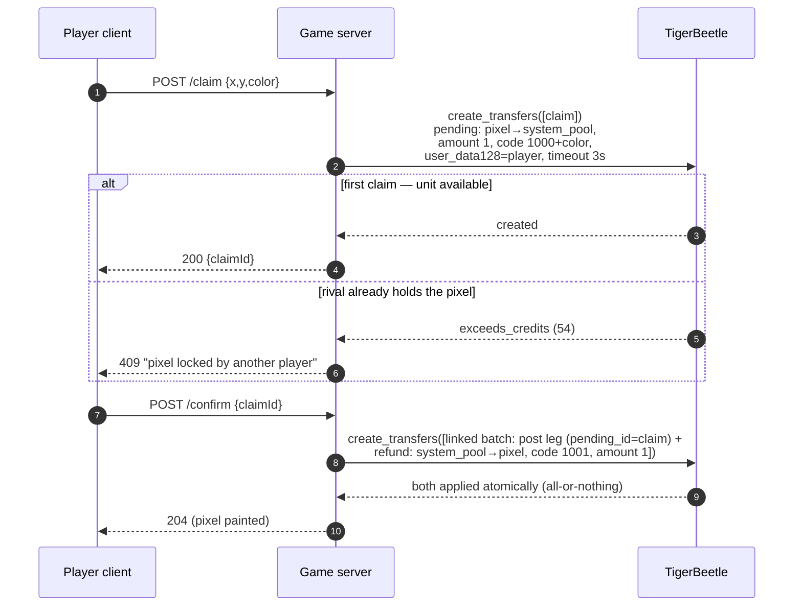
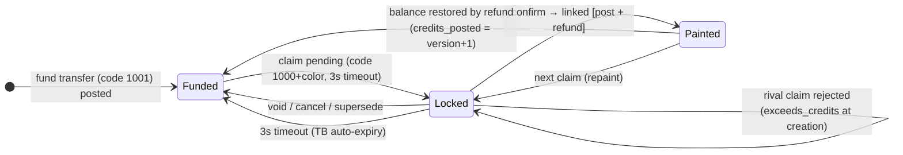
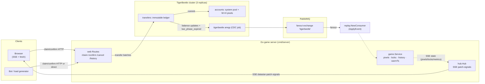

# How PixelBeetle uses TigerBeetle

A developer-facing reference for how the game's domain is modeled in the
TigerBeetle database: what is stored, how a claim moves money between accounts,
and why the canvas is a *derived projection* of an immutable ledger.

Key invariants at a glance:

- **TigerBeetle is the only durable state.** No SQL, no Redis, no Postgres. The
  canvas, the lock table, and the time-travel history are all projections
  rebuilt from the ledger (or loaded from a snapshot of a projection).
- **Exclusivity is enforced by the database, not the app.** A second claim on a
  locked pixel fails *at transfer creation* with `exceeds_credits` (status 54),
  surfaced to the player as HTTP 409.
- **Nothing is overwritten.** Every paint, every cancelled claim, every expiry
  is a new transfer. The full history of the canvas exists forever in the
  ledger — which is what makes time travel "free" (the slider replays paints,
  not states).

---

## 1. Account model

Two account kinds, one ledger (`LedgerCanvas = 1`):

| account | id | code | purpose |
|---|---|---|---|
| system pool | `SystemPoolID = Uint128(1)` | `999` | holds the whole canvas's "currency"; the credit side of every claim |
| pixel `<x,y>` | `PixelID(x,y)` | `1000` | one per cell; balance = 1 is the cell's single claimable unit |

Pixel ids are packed into a dedicated 128-bit namespace: low 64 bits hold
`x<<32 | y`, high 64 bits hold `PixelIDMarker = 1`. The marker guarantees a
pixel id is never `0` (TB rejects zero ids) and never collides with the system
pool's id `1`. `UnpackPixelID` validates the marker and recovers `(x,y)`.

Every **pixel** account is created with `AccountFlags.DebitsMustNotExceedCredits`
set — that flag is the exclusivity invariant, and it lives in the database.



A pixel account's **balance** only says "claimable (1) / already claimed (0)";
`credits_posted` says how many times it has been painted (its version). It does
**not** store the color — colors live on transfers only (see below).

---

## 2. Transfer conventions

All transfer codes are on `LedgerCanvas = 1`.

| code | meaning | writer |
|---|---|---|
| `1000 + color` (1000–1015) | claim (pending) / posted paint | `tbclient.NewClaim` |
| `1001` | re-fund leg after a confirmed paint **and** initial pixel funding (idempotent via deterministic `FundID`) | `BuildConfirm`, `Fund` |
| `999` | system-pool account code (accounts only) | — |

Notes:

- The claim code is the base **plus** the palette index (`TransferCodeClaim +
  color`), never bitwise-OR: `1000` already has bit 3 set, so OR aliases colors
  8–15 onto 0–7. Colors are validated `≤ MaxColor (15)` at the API so codes
  stay in 1000–1015 and never wander into other ranges.
- Code `1001` is shared by "claim color 1" and "refund". They are
  disambiguated by transfer **flags**: posted-claim legs always carry the
  `post_pending_transfer` bit, refund legs never do.
- Claim ids are **UUIDv7** (fresh per attempt — failed ids are sticky in TB, so
  every retry must mint a new one). Fund ids are deterministic:
  `uint128(fundMarker=0xF00D << 64 | x<<32 | y)` so re-funding is idempotent
  (`exists` == success).

### The exclusivity trick

The classic TigerBeetle "provision a spendable unit" pattern applied per pixel:

1. System pool funds the pixel with balance 1 (one-time, idempotent).
2. A claim is a **pending transfer debiting 1 from the pixel** (credit side:
   system pool). `DebitsMustNotExceedCredits` makes a *second* pending on the
   same pixel fail at creation with `exceeds_credits` — the unit can only be
   reserved once, and TigerBeetle decides the winner, not the app.
3. Confirming posts the pending (unit is now gone) and **re-funds** the pixel
   straight back to balance 1, atomically, in one linked batch.

---

## 3. Claim lifecycle



Cancel, expiry, and supersede are all **voids**:

```mermaid
sequenceDiagram
    participant C as Player client
    participant S as Game server
    participant T as TigerBeetle
    participant R as RabbitMQ/CDC

    C->>S: POST /cancel {claimId}  (or player claims another cell, or 3s timeout)
    S->>T: create_transfers([void leg: pending_id=claim])
    alt explicit cancel/supersede
        T-->>S: voided
    else timeout
        T->>R: two_phase_expired event (TB auto-expires the pending)
        R->>S: ApplyEvent (expired)
    end
    Note over S: lock released → cell claimable again; UI lock overlay cleared
```

Notes for implementers:

- A player holds **at most one active claim** — enforced server-side. Claiming a
  new cell first voids the player's previous pending (and the freed cell is
  immediately claimable by anyone).
- The in-memory lock table is only a UX gate; the durable arbiter is the
  pending transfer in TB. A rival who races past the app-level lock still gets
  `exceeds_credits` from the database.
- `SubmitBatch` treats created / exists / already-posted / already-voided as
  success, and any `exceeds_credits` as `ErrPixelLocked` (→ 409). Everything
  else is a hard error.
- After a server restart, pending claims are **not** restored — their 3s
  timeout expires them in TB automatically and the reaper clears UI locks.

---

## 4. Pixel cell state machine



| state | durable artifact in TB | in-RAM projection |
|---|---|---|
| funded / empty | fund transfer posted; pixel account balance = 1 | absent from `pixels` map |
| locked | **pending** transfer exists (`flags & pending`) | `locks[key]` (with 3s expiry) |
| painted | pending + **post leg** + refund posted | `pixels[key] = {color, version}` |

---

## 5. Data flow: writes and reads



### Read paths

1. **Boot warmup (full)**: `WarmCache` pages `QueryCanvasTransfers` in chunks of
   4000 (ledger 1, ascending from an inclusive `TimestampMin`), folds only
   posted-claim legs (`flags & post_pending_transfer`), and derives
   `pixels` (color + version) and the `history` slider manifest in one pass.
   It records `warmTs` = the newest folded timestamp.
2. **Boot warmup (snapshot + delta)**: if `data/snapshot.bin` exists and matches
   the grid, the server loads the materialized state and folds **only**
   transfers with timestamp > the snapshot's watermark — O(events since last
   snapshot) instead of O(all history). The ledger remains the source of
   truth; a stale/corrupt snapshot just falls back to a full replay.
3. **Live CDC**: `tigerbeetle amqp` streams transfers + balance updates to the
   fanout exchange; `ApplyEvent` ingests posted claims. Events at or below the
   `warmTs` watermark are history replays of what warmup already folded and are
   **dropped** — this prevents a backlog replay from re-broadcasting old paints
   or bloating the slider manifest.

---

## 6. What lives where

| state | store | location | rebuildable? |
|---|---|---|---|
| accounts (one per pixel + system pool) | **TigerBeetle** | durable, replicated | idempotent re-ensure |
| transfer ledger (every paint/void/expiry) | **TigerBeetle** | durable, replicated | ✗ it IS the history |
| pixel cache `{color, version}` | in-RAM projection | `game.Service.pixels` | yes — warmup / snapshot / CDC |
| lock table (active claims) | in-RAM projection | `game.Service.locks` | no — self-expires in TB after 3s |
| time-travel manifest `[]PaintEvent` | in-RAM projection | `game.Service.history` | yes — warmup / snapshot |
| canvas bitmap (1 byte/cell) | derived on demand | `SnapshotBmp` (base64 over SSE) | yes — from `pixels` |
| **on-disk snapshot** | file `data/snapshot.bin` | atomic temp+rename, ~30s ticker | yes — fallback = full replay |

The snapshot deliberately excludes locks (they self-expire) and the bitmap
(cheap to re-derive from history at load) — it stores only the watermark, grid,
and the ordered paint-event manifest.